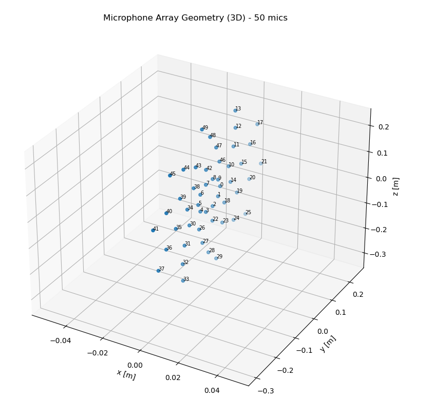
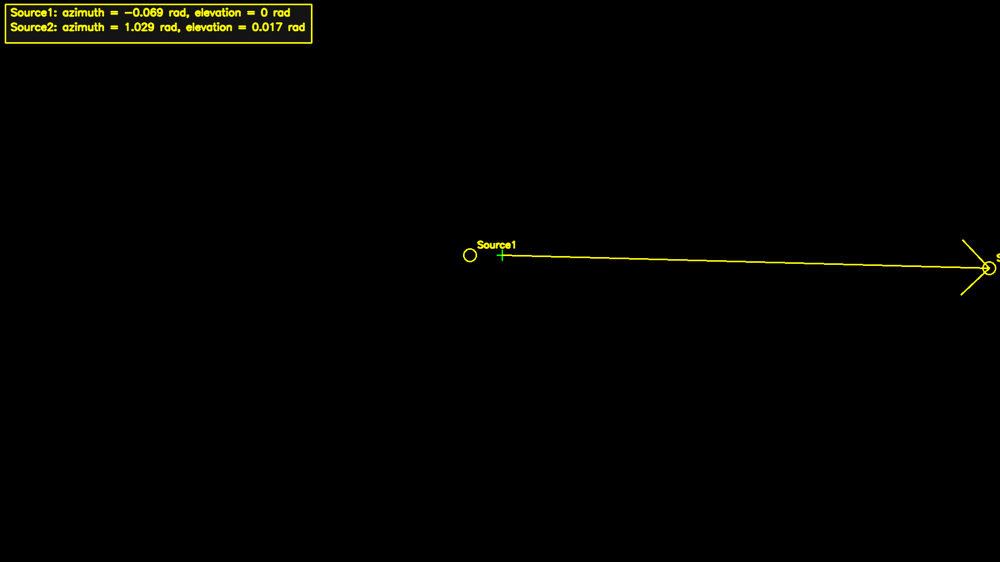

# Insignito – Beamforming Assignment (LCMV / MVDR)





This repository contains a complete solution for the **Beamforming** task.

We are given a **50-channel microphone array** recording that contains a mixture of **two acoustic sources** with known directions of arrival (DOA).  
The goal is to design a beamformer that enhances each source while suppressing the other (and background noise).

---

## Approach (Short)

This solution uses **frequency-domain LCMV beamforming** (MVDR with linear constraints):

- **Output 1**: distortionless response to **Source #1** + **null** towards **Source #2**
- **Output 2**: distortionless response to **Source #2** + **null** towards **Source #1**

To be robust on real recordings, it performs **basic microphone quality checks** (dead / noisy / clipped channels) and excludes problematic microphones before beamforming.

---

## Repository Structure

```
Insignito/
  main.py
  overlay_sources_on_image.py
  requirements.txt
  README.md
  outputs/
    source1.wav
    source2.wav
    sound_overlay.png
  utils/
    recording.wav
    array_geometry.yaml
    mono_converter.py
    plot_geometry.py
    recording_mono.wav
  images/
    mic_array_3d.png
```

---

## Input Data

Located under `utils/`:

- `recording.wav` – Multichannel WAV (**50 synchronized channels**)
- `array_geometry.yaml` – Microphone positions (`array_geometry`) + camera parameters (for the bonus overlay)
- Optional utilities:
  - `recording_mono.wav` – Mono preview for listening
  - `mono_converter.py` – Mono converter helper
  - `plot_geometry.py` – Microphone array geometry visualization

---

## Outputs

The main script generates (under `outputs/`):

- `outputs/source1.wav` – Beamformed mono signal toward **DOA #1**
- `outputs/source2.wav` – Beamformed mono signal toward **DOA #2**

Bonus script output:

- `outputs/sound_overlay.png` – DOA projection on a blank camera canvas

---

## Requirements

### Main beamforming script (`main.py`) – NO SciPy
This repo intentionally avoids SciPy to prevent NumPy/SciPy binary compatibility issues on some environments.

Install dependencies from `requirements.txt`:

```powershell
pip install -r requirements.txt
```

`requirements.txt` (main):
- numpy
- soundfile
- pyyaml

### Bonus overlay script (`overlay_sources_on_image.py`)
If you want to run the bonus overlay script, also install:

```powershell
pip install opencv-python
```

---

## How to Run

From the project root:

```powershell
python .\main.py --input_wav .\utils\recording.wav --geometry_yaml .\utils\array_geometry.yaml --out_dir .\outputs
```

After running, you should have:

- outputs\source1.wav
- outputs\source2.wav

---

## Optional Arguments

### Control STFT parameters

```powershell
python .\main.py --input_wav .\utils\recording.wav --geometry_yaml .\utils\array_geometry.yaml --out_dir .\outputs --n_fft 2048 --hop 512
```

### Change speed of sound

```powershell
python .\main.py --input_wav .\utils\recording.wav --geometry_yaml .\utils\array_geometry.yaml --out_dir .\outputs --c 343
```

---

## Run from inside `utils/` (Alternative)

```powershell
cd .\utils
python ..\main.py --input_wav .\recording.wav --geometry_yaml .\array_geometry.yaml --out_dir ..\outputs
```

---

## Pipeline – Step by Step (Aligned to the Script Output)

When you run the script, it prints numbered steps like `[STEP 1] ...` through `[STEP 11] ...`.
Below is what each step means and why it exists.

### STEP 1) Load geometry YAML
Reads `array_geometry.yaml` and loads **M microphone positions** (shape `(M,3)` in meters).  
This geometry is required to compute **relative propagation delays** between microphones for a given DOA.

### STEP 2) Load multichannel WAV
Loads `recording.wav` as an array of shape `(N, M)` and sample rate `fs`.  
A small cleanup is applied: **DC removal per channel** (subtract mean), because offsets can leak into low-frequency bins and harm covariance estimates.

### STEP 3) Align audio channels with geometry (if mismatch)
If the WAV has a different number of channels than the geometry file has microphones, the script uses the first `min(M_wav, M_geom)` channels/mics so both arrays match.

### STEP 4) Detect and exclude bad microphones (dead/noisy/clipped)
Computes a quick health check per channel:
- **dead**: RMS too low (channel is basically silent / disconnected)
- **noisy**: RMS too high (channel dominated by strong noise)
- **clipped**: too many samples near ±1.0 (ADC saturation)

Bad microphones are excluded from both `x` and `mic_pos`, improving stability and output quality.

### STEP 5) Choose STFT parameters (`n_fft` / `hop`)
Chooses window size and hop:
- `n_fft` controls **frequency resolution**: `Δf = fs / n_fft`
- `hop` controls **time resolution** and overlap (default: hop = n_fft/4 → 75% overlap)

### STEP 6) Define DOAs (given by assignment)
Defines the two known DOAs (azimuth/elevation in radians):
- DOA1: az = -0.069, el = 0.0
- DOA2: az =  1.029, el = 0.017

### STEP 7) Compute STFT for all microphones (NO SciPy)
Computes STFT for each microphone channel using Hann window + overlap framing + one-sided rFFT.  
Produces `X` with shape `(F, T, M)`.

### STEP 8) Beamform source #1 (target=DOA1, null=DOA2)
Per frequency bin:
1. Estimate covariance `R(f)` from `X`.
2. Build constraints `C = [a_target, a_interferer]`.
3. Solve LCMV weights `w(f)` s.t. `wᴴ a_target = 1` and `wᴴ a_interferer = 0`.
Then apply weights to get output STFT `Y1`.

### STEP 9) Beamform source #2 (target=DOA2, null=DOA1)
Same as STEP 8, but swap target/interferer constraints to get output STFT `Y2`.

### STEP 10) Inverse STFT to time domain (overlap-add)
IFFT per frame + overlap-add reconstruction back to time domain, trimmed to the original length `N`.

### STEP 11) Normalize outputs and save WAV files
Normalize each output to a fixed peak (0.99) and write:
- `outputs/source1.wav`
- `outputs/source2.wav`

---

## Bonus – DOA overlay on camera canvas (no camera frame needed)

This repository includes a small bonus script that projects the **DOA directions** onto a **blank camera canvas** using the camera intrinsics/extrinsics in `array_geometry.yaml`.

Run:

```powershell
python .\overlay_sources_on_image.py --yaml utils\array_geometry.yaml --blank --invert_extrinsics --out outputs\sound_overlay.png
```

---

## Notes

- The solution assumes a **far-field plane-wave** model and uses the assignment-provided DOA convention.
- Real recordings often contain degraded channels; excluding **dead/noisy/clipped** mics improves robustness.

---

## 5) טיפ חשוב להגשה (Submission Tips)

כדאי לציין (ואפשר להגיד בביטחון):

- יש **regularization (diagonal loading)** על מטריצת הקו-וריאנס `R` כדי לשפר יציבות נומרית ולא להיתקע על מטריצה קרובה לסינגולרית.
- יש **בדיקת sign** (בחירת סימן הדיליי) כדי לא להיתקע על **קונבנציית כיוונים** שגויה (צירי קואורדינטות / סימן דיליי).
- יש **mic quality check** כדי להתמודד עם **data אמיתי** (ערוצים מתים/רועשים/קליפינג) לפני ה-beamforming.
